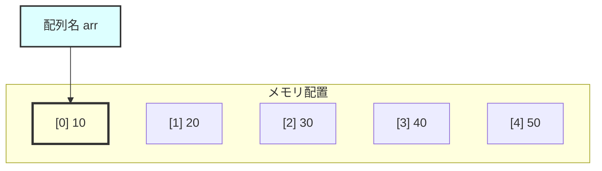

# 配列とポインター

## 対応C規格

- **主要対象：** C90
- **学習内容：** 配列とポインターの関係、ポインターを使った配列操作、関数への配列渡し

## 学習目標

この章を完了すると、以下のことができるようになります。

- 配列式が先頭要素へのポインターに変換される条件を理解する
- ポインター演算を使った配列操作ができる
- 配列を関数に渡す仕組みを理解する
- 配列とポインターの型やサイズの違いを説明できる

## 概要と詳細

### 前提知識

この章は、次の内容を理解していることを前提とします。

- 第7章：配列（基本編）
- 第8章：ポインター基礎

### 配列とポインターの関係

Cでは、配列式が多くの文脈で先頭要素へのポインターに変換されます。
この変換によって同じ添字記法を使えますが、配列とポインターは異なる型のオブジェクトです。

#### 配列式からポインターへの変換

配列を表す式は、`sizeof`のオペランドまたは単項`&`のオペランドになる場合を除き、通常は先頭要素へのポインターに変換されます。
次の例では、`arr`と`&arr[0]`は同じアドレスを表します。
一方、`&arr`の値として表現されるアドレスは同じでも、型は配列全体へのポインター`int (*)[5]`です。

```c
int arr[5] = {10, 20, 30, 40, 50};

/* 3つの値は同じアドレスとして表示されるが、式の型は異なる */
printf("arr      = %p\n", (void *)arr);
printf("&arr[0]  = %p\n", (void *)&arr[0]);
printf("&arr     = %p\n", (void *)&arr);
```

#### 視覚的な理解



配列`int arr[5] = {10, 20, 30, 40, 50}`の要素は、添字の順に連続して配置されます。
次のアドレスは、`sizeof(int) == 4`で先頭アドレスを1000と仮定した例です。

- **メモリアドレス**：配列の要素は連続したメモリ領域に配置されます
    - `arr[0]`：アドレス1000、値10
    - `arr[1]`：アドレス1004、値20
    - `arr[2]`：アドレス1008、値30
    - `arr[3]`：アドレス1012、値40
    - `arr[4]`：アドレス1016、値50

- **配列式の変換後の値**：`arr`は、通常の式では最初の要素`arr[0]`へのポインターに変換されます

- **アドレスの増分**：この例では`sizeof(int) == 4`なので、各要素のアドレスは4ずつ増加します

### 配列要素へのアクセス方法の等価性

#### 2つの記法

C言語では、配列要素にアクセスする方法が2つあります。

```c
int arr[5] = {10, 20, 30, 40, 50};
int i;

/* 添字演算とポインター演算は同じ要素を参照する */
for (i = 0; i < 5; i++) {
    printf("arr[%d] = %d\n", i, arr[i]);        /* 配列記法 */
    printf("*(arr+%d) = %d\n", i, *(arr+i));    /* ポインター記法 */
}

/* arr[i] は *((arr) + (i)) と定義される */
```

#### 添字演算の仕組み


添字演算`E1[E2]`は`*((E1) + (E2))`と定義されています。
`arr[2]`では、次の順序で参照先が決まります。

1. **配列名は先頭アドレス**
    - 式`arr`が、配列の最初の要素へのポインターに変換されます

2. **インデックスによるアドレス計算**
    - `arr[2]`にアクセスする場合、`i = 2`です
    - `arr + i`は「先頭から`i`要素分進んだアドレス」を計算します

3. **実際のアドレス計算**
    - `sizeof(int) == 4`と仮定すると、`arr + 2`が表すアドレスは1000 + (2 × 4) = 1008です
    - これは3番目の要素（インデックス2）のアドレスです

4. **値の取得**
    - `*(arr + i)` でそのアドレスに格納された値を取得します
    - この定義により、`arr[2]`と`*(arr + 2)`は同じ要素を表します

### 配列とポインターの違い

配列式はポインターに変換されることがありますが、配列そのものがポインターになるわけではありません。

#### 配列には代入できない

```c
int arr[5] = {1, 2, 3, 4, 5};
int *ptr = arr;  /* OK: 配列の先頭アドレスをポインターに代入 */

/* 配列は変更可能な左辺値ではないため、代入やインクリメントはできない */
arr = ptr;       /* 制約違反 */
arr++;           /* 制約違反 */

/* ポインターは変数（変更可能） */
ptr++;           /* OK: ポインターを次の要素に移動 */
ptr = &arr[3];   /* OK: ポインターに別のアドレスを代入 */
```

#### サイズの違い

```c
int arr[5] = {1, 2, 3, 4, 5};
int *ptr = arr;

printf("sizeof(arr) = %lu\n", (unsigned long)sizeof(arr));
printf("sizeof(ptr) = %lu\n", (unsigned long)sizeof(ptr));
```

`sizeof(arr)`は配列全体のバイト数であり、`5 * sizeof(int)`です。
`sizeof(ptr)`はポインター自体のバイト数なので、両者が同じ値になる保証はありません。

### ポインター演算による配列操作

#### ポインターの移動

```c
#include <stdio.h>

int main(void) {
    int arr[5] = {10, 20, 30, 40, 50};
    int *ptr = arr;

    printf("Value: %d\n", *ptr);      /* 10 */

    ptr++;  /* 次の要素へ移動 */
    printf("Value: %d\n", *ptr);      /* 20 */

    ptr += 2;  /* 2つ先の要素へ移動 */
    printf("Value: %d\n", *ptr);      /* 40 */

    return 0;
}
```

#### ポインターを使った配列の走査

```c
#include <stdio.h>

int main(void) {
    int arr[5] = {1, 2, 3, 4, 5};
    int *ptr;

    /* 方法1: 終端の一つ後ろを表すポインターと比較 */
    printf("Compare with end pointer:\n");
    for (ptr = arr; ptr < arr + 5; ptr++) {
        printf("%d ", *ptr);
    }
    printf("\n");

    /* 方法2: 最後の要素へのポインターと比較 */
    printf("Compare with last element:\n");
    ptr = arr;
    while (ptr <= &arr[4]) {
        printf("%d ", *ptr);
        ptr++;
    }
    printf("\n");

    return 0;
}
```

### 関数への配列の渡し方

関数の仮引数に書いた配列型は、対応するポインター型に調整されます。
呼び出し側の配列式も先頭要素へのポインターへ変換され、そのポインター値が値渡しされます。
配列全体がコピーされるわけではありません。

#### 関数の宣言方法

```c
/* 関数型としては、いずれも仮引数がint *に調整される */
void process_array(int arr[]);
void process_array(int *arr);
void process_array(int arr[10]);
```

3番目の`10`は、この宣言だけでは要素数の検査や受け渡しを行いません。
関数が処理する要素数は、別の引数で明示します。

#### 配列を受け取る関数の例

```c
#include <stdio.h>

/* 配列の合計を計算する関数 */
int array_sum(int *arr, int size) {
    int sum = 0;
    int i;

    for (i = 0; i < size; i++) {
        sum += arr[i];  /* または sum += *(arr + i); */
    }

    return sum;
}

/* 配列の要素をすべて2倍にする関数 */
void double_array(int arr[], int size) {
    int i;

    for (i = 0; i < size; i++) {
        arr[i] *= 2;  /* 元の配列が変更される */
    }
}

int main(void) {
    int numbers[5] = {1, 2, 3, 4, 5};
    int total;
    int i;

    /* 合計を計算 */
    total = array_sum(numbers, 5);
    printf("Total: %d\n", total);

    /* 配列を2倍に */
    printf("Before: ");
    for (i = 0; i < 5; i++) {
        printf("%d ", numbers[i]);
    }
    printf("\n");

    double_array(numbers, 5);

    printf("After: ");
    for (i = 0; i < 5; i++) {
        printf("%d ", numbers[i]);
    }
    printf("\n");

    return 0;
}
```

### 多次元配列と行へのポインター

#### 2次元配列のメモリ配置

```c
int matrix[3][4] = {
    {1, 2, 3, 4},
    {5, 6, 7, 8},
    {9, 10, 11, 12}
};

/* 要素は行優先で連続して配置される */
/* [1][2][3][4][5][6][7][8][9][10][11][12] */
```

#### 2次元配列へのポインター

```c
int matrix[3][4];
int (*ptr)[4] = matrix;  /* 4要素のint配列へのポインター */

/* 以下はすべて同じ要素にアクセス */
matrix[1][2];         /* 通常のアクセス */
*(*(matrix + 1) + 2); /* ポインター演算 */
ptr[1][2];           /* ポインター経由のアクセス */
```

式`matrix`は、先頭行へのポインター`int (*)[4]`に変換されます。
列数の4はポインター演算で1行分進むために必要なので、省略できません。

### 実践的な応用例

#### 配列の最大値を見つける（ポインター版）

```c
#include <stdio.h>

int *find_max(int *arr, int size) {
    int *max_ptr = arr;
    int i;

    for (i = 1; i < size; i++) {
        if (*(arr + i) > *max_ptr) {
            max_ptr = arr + i;
        }
    }

    return max_ptr;  /* 最大値へのポインターを返す */
}

int main(void) {
    int numbers[5] = {34, 67, 12, 89, 45};
    int *max_ptr;

    max_ptr = find_max(numbers, 5);

    printf("Maximum: %d\n", *max_ptr);
    printf("Index: %ld\n", (long)(max_ptr - numbers));

    return 0;
}
```

`find_max`は、`arr`が少なくとも`size`個の要素を指し、`size > 0`であることを前提とします。

#### 文字列操作の基礎

```c
#include <stdio.h>

/* 文字列の長さを計算（ポインター版） */
int string_length(const char *str) {
    const char *start = str;

    while (*str != '\0') {
        str++;
    }

    return str - start;  /* ポインターの差が文字数 */
}

int main(void) {
    char message[] = "Hello, World!";
    int len;

    len = string_length(message);
    printf("Length: %d\n", len);

    return 0;
}
```

### よくある間違いと注意点

#### 1. 配列の境界を超えたアクセス

```c
int arr[5] = {1, 2, 3, 4, 5};
int *ptr = arr;

ptr += 10;  /* このポインター演算自体が未定義動作 */
```

同じ配列内の要素、または終端の一つ後ろを超えるポインターを生成してはいけません。
終端の一つ後ろを表すポインターは比較には使えますが、間接参照はできません。

#### 2. ポインターと配列の混同

```c
int arr[5];
int *ptr;

sizeof(arr);  /* 5 * sizeof(int): 配列全体のサイズ */
sizeof(ptr);  /* ポインター自体のサイズ */
```

#### 3. 関数での配列サイズ

```c
void process(int arr[]) {
    /* 仮引数arrの型はint *に調整されるため、sizeof(arr)はポインターのサイズ */
    /* 配列のサイズは別途引数で渡す必要がある */
}
```

## 実例コード

完全な実装例は以下のファイルを参照してください。

### 配列とポインターの基本

- [array_pointer_basics.c](examples/array_pointer_basics.c) - C90準拠版
- [array_pointer_basics_c99.c](examples/array_pointer_basics_c99.c) - C99準拠版

### 高度な配列操作

- [advanced_array_ops.c](examples/advanced_array_ops.c) - C90準拠版
- [advanced_array_ops_c99.c](examples/advanced_array_ops_c99.c) - C99準拠版

## 学習のポイント

1. **配列式の変換**：配列式は、多くの文脈で先頭要素へのポインターに変換されます
2. **添字演算**：`arr[i]`は`*(arr + i)`と定義されています
3. **仮引数の型調整**：関数仮引数の`int arr[]`は`int *arr`に調整されます
4. **値渡し**：関数には変換後のポインター値が渡され、要素数は別に渡します

## 次の章へ

次の[文字列処理](../strings/README.md)では、文字配列と文字列リテラルを扱います。
配列式の変換と境界の考え方は、文字列を安全に走査するときにも必要です。

## 参考資料

- [C90規格書](https://www.iso.org/standard/17782.html)
- [ポインターと配列の詳細](https://en.cppreference.com/w/c/language/array)

## 演習問題

[演習問題](exercises/)では、配列式の変換、添字演算、関数仮引数の型調整をコードで確認できます。

- 基礎問題：基本的な文法や概念の確認
- 応用問題：より実践的なプログラムの作成
- チャレンジ問題：高度な理解と実装力が必要な問題
