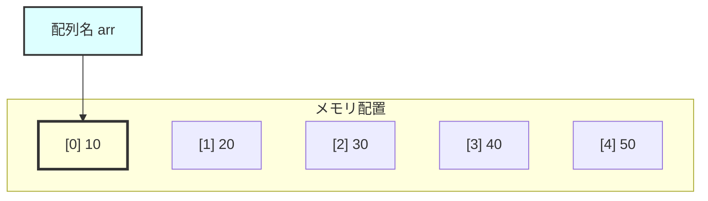
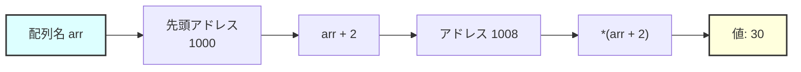

# 配列とポインターー

## 対応C規格

- **主要対象:** C90
- **学習内容:** 配列とポインターーの関係、ポインターーを使った配列操作、関数への配列渡し

## 学習目標

この章を完了すると、以下のことができるようになります。

- 配列名がポインターとして扱われることを理解する
- ポインターー演算を使った配列操作ができる
- 配列を関数に渡す仕組みを理解する
- より効率的な配列処理ができる

## 概要と詳細

### 前提知識

この章を学習する前に、以下の章を完了していることを前提とします：

- 第7章: 配列（基本編）
- 第8章: ポインターー基礎

### 配列とポインターーの関係

C言語において、配列とポインターーには密接な関係があります。この関係を理解することは、C言語をマスターする上で非常に重要です。

#### 配列名の本質

配列名は、配列の最初の要素へのポインターとして扱われます。

```c
int arr[5] = {10, 20, 30, 40, 50};

/* 以下の3つは同じアドレスを示す */
printf("arr      = %p\n", arr);       /* 配列名 */
printf("&arr[0]  = %p\n", &arr[0]);   /* 最初の要素のアドレス */
printf("&arr     = %p\n", &arr);      /* 配列全体のアドレス（値は同じ） */
```

#### 視覚的な理解



配列 `int arr[5] = {10, 20, 30, 40, 50}` のメモリ配置を詳しく見てみましょう：

- **メモリアドレス**：配列の要素は連続したメモリ領域に配置されます
    - `arr[0]`: アドレス 1000、値 10
    - `arr[1]`: アドレス 1004、値 20
    - `arr[2]`: アドレス 1008、値 30
    - `arr[3]`: アドレス 1012、値 40
    - `arr[4]`: アドレス 1016、値 50

- **配列名の意味**：`arr` は配列の最初の要素（arr[0]）のアドレスを表します

- **アドレスの増分**：int型は4バイトなので、各要素のアドレスは4ずつ増加します

### 配列要素へのアクセス方法の等価性

#### 2つの記法

C言語では、配列要素にアクセスする方法が2つあります。

```c
int arr[5] = {10, 20, 30, 40, 50};
int i;

/* 以下の2つの方法は完全に等価 */
for (i = 0; i < 5; i++) {
    printf("arr[%d] = %d\n", i, arr[i]);        /* 配列記法 */
    printf("*(arr+%d) = %d\n", i, *(arr+i));    /* ポインターー記法 */
}

/* つまり、arr[i] は *(arr + i) の糖衣構文（シンタックスシュガー） */
```

#### なぜこれが等価なのか？



配列の要素にアクセスする際の内部動作を詳しく見てみましょう：

1. **配列名は先頭アドレス**
    - `arr` は配列の最初の要素のアドレス（例：1000）を表します

2. **インデックスによるアドレス計算**
    - `arr[2]` にアクセスする場合、`i = 2` です
    - `arr + i` は「先頭から i 要素分進んだアドレス」を計算します

3. **実際のアドレス計算**
    - int型は通常4バイトなので、`arr + 2` = 1000 + (2 × 4) = 1008
    - これは3番目の要素（インデックス2）のアドレスです

4. **値の取得**
    - `*(arr + i)` でそのアドレスに格納された値を取得します
    - これは `arr[2]` と完全に同じ結果になります

### 配列とポインターーの違い

配列名はポインターのように振る舞いますが、重要な違いがあります。

#### 配列名は定数

```c
int arr[5] = {1, 2, 3, 4, 5};
int *ptr = arr;  /* OK: 配列の先頭アドレスをポインターに代入 */

/* 配列名は定数（変更不可） */
arr = ptr;       /* エラー: 配列名への代入はできない */
arr++;           /* エラー: 配列名の変更はできない */

/* ポインターーは変数（変更可能） */
ptr++;           /* OK: ポインターーを次の要素に移動 */
ptr = &arr[3];   /* OK: ポインターーに別のアドレスを代入 */
```

#### サイズの違い

```c
int arr[5] = {1, 2, 3, 4, 5};
int *ptr = arr;

printf("sizeof(arr) = %lu\n", sizeof(arr));  /* 20（5×4バイト） */
printf("sizeof(ptr) = %lu\n", sizeof(ptr));  /* 8（64ビット環境）or 4（32ビット環境） */
```

### ポインターー演算による配列操作

#### ポインターーの移動

```c
#include <stdio.h>

int main(void) {
    int arr[5] = {10, 20, 30, 40, 50};
    int *ptr = arr;

    printf("ptr が指す値: %d\n", *ptr);      /* 10 */

    ptr++;  /* 次の要素へ移動 */
    printf("ptr が指す値: %d\n", *ptr);      /* 20 */

    ptr += 2;  /* 2つ先の要素へ移動 */
    printf("ptr が指す値: %d\n", *ptr);      /* 40 */

    return 0;
}
```

#### ポインターーを使った配列の走査

```c
#include <stdio.h>

int main(void) {
    int arr[5] = {1, 2, 3, 4, 5};
    int *ptr;

    /* 方法1: インデックスを使用 */
    printf("インデックスを使用:\n");
    for (ptr = arr; ptr < arr + 5; ptr++) {
        printf("%d ", *ptr);
    }
    printf("\n");

    /* 方法2: ポインターーの比較 */
    printf("ポインターーの比較:\n");
    ptr = arr;
    while (ptr <= &arr[4]) {
        printf("%d ", *ptr);
        ptr++;
    }
    printf("\n");

    return 0;
}
```

### 関数への配列の渡し方

配列を関数に渡すとき、実際には先頭要素へのポインターが渡されます。

#### 関数の宣言方法

```c
/* これらの宣言は同じ意味 */
void process_array(int arr[]);      /* 配列として宣言 */
void process_array(int *arr);       /* ポインターーとして宣言 */
void process_array(int arr[10]);    /* サイズ指定（無視される） */
```

#### 配列を受け取る関数の例

```c
#include <stdio.h>

/* 配列の合計を計算する関数 */
int array_sum(int *arr, int size) {
    int sum = 0;
    int i;

    for (i = 0; i < size; i++) {
        sum += arr[i];  /* または sum += *(arr + i); */
    }

    return sum;
}

/* 配列の要素をすべて2倍にする関数 */
void double_array(int arr[], int size) {
    int i;

    for (i = 0; i < size; i++) {
        arr[i] *= 2;  /* 元の配列が変更される */
    }
}

int main(void) {
    int numbers[5] = {1, 2, 3, 4, 5};
    int total;
    int i;

    /* 合計を計算 */
    total = array_sum(numbers, 5);
    printf("合計: %d\n", total);

    /* 配列を2倍に */
    printf("元の配列: ");
    for (i = 0; i < 5; i++) {
        printf("%d ", numbers[i]);
    }
    printf("\n");

    double_array(numbers, 5);

    printf("2倍後: ");
    for (i = 0; i < 5; i++) {
        printf("%d ", numbers[i]);
    }
    printf("\n");

    return 0;
}
```

### 多次元配列とポインターー

#### 2次元配列のメモリ配置

```c
int matrix[3][4] = {
    {1, 2, 3, 4},
    {5, 6, 7, 8},
    {9, 10, 11, 12}
};

/* メモリ上では一次元的に配置される */
/* [1][2][3][4][5][6][7][8][9][10][11][12] */
```

#### 2次元配列へのポインター

```c
int matrix[3][4];
int (*ptr)[4] = matrix;  /* 4要素のint配列へのポインター */

/* 以下はすべて同じ要素にアクセス */
matrix[1][2];         /* 通常のアクセス */
*(*(matrix + 1) + 2); /* ポインターー演算 */
ptr[1][2];           /* ポインターー経由のアクセス */
```

### 実践的な応用例

#### 配列の最大値を見つける（ポインターー版）

```c
#include <stdio.h>

int* find_max(int *arr, int size) {
    int *max_ptr = arr;
    int i;

    for (i = 1; i < size; i++) {
        if (*(arr + i) > *max_ptr) {
            max_ptr = arr + i;
        }
    }

    return max_ptr;  /* 最大値へのポインターを返す */
}

int main(void) {
    int numbers[5] = {34, 67, 12, 89, 45};
    int *max_ptr;

    max_ptr = find_max(numbers, 5);

    printf("最大値: %d\n", *max_ptr);
    printf("最大値の位置: %ld\n", max_ptr - numbers);

    return 0;
}
```

#### 文字列操作の基礎

```c
#include <stdio.h>

/* 文字列の長さを計算（ポインターー版） */
int string_length(char *str) {
    char *start = str;

    while (*str != '\0') {
        str++;
    }

    return str - start;  /* ポインターーの差が文字数 */
}

int main(void) {
    char message[] = "Hello, World!";
    int len;

    len = string_length(message);
    printf("文字列の長さ: %d\n", len);

    return 0;
}
```

### よくある間違いと注意点

#### 1. 配列の境界を超えたアクセス

```c
int arr[5] = {1, 2, 3, 4, 5};
int *ptr = arr;

ptr += 10;  /* 危険！配列の範囲外 */
*ptr = 100; /* 未定義動作 */
```

#### 2. ポインターーと配列の混同

```c
int arr[5];
int *ptr;

sizeof(arr);  /* 20: 配列全体のサイズ */
sizeof(ptr);  /* 4 or 8: ポインターーのサイズ */
```

#### 3. 関数での配列サイズ

```c
void process(int arr[]) {
    /* sizeof(arr) はポインターのサイズを返す！ */
    /* 配列のサイズは別途引数で渡す必要がある */
}
```

## 実例コード

完全な実装例は以下のファイルを参照してください。

### 配列とポインターーの基本

- [array_pointer_basics.c](examples/array_pointer_basics.c) - C90準拠版
- [array_pointer_basics_c99.c](examples/array_pointer_basics_c99.c) - C99準拠版

### 高度な配列操作

- [advanced_array_ops.c](examples/advanced_array_ops.c) - C90準拠版
- [advanced_array_ops_c99.c](examples/advanced_array_ops_c99.c) - C99準拠版

## 学習のポイント

1. **配列名 = ポインターー定数**: 配列名は変更できないポインター
2. **arr[i] = *(arr + i)**: 2つの記法は完全に等価
3. **関数への渡し方**: 配列は常にポインターとして渡される
4. **サイズ情報**: 関数では配列のサイズが分からないので別途渡す

## 次の章へ

配列とポインターーの関係を理解したら、[文字列処理](../strings/README.md) に進んでください。文字列は文字の配列として扱われるため、この知識が活かされます。

## 参考資料

- [C90規格書](https://www.iso.org/standard/17782.html)
- [ポインターーと配列の詳細](https://en.cppreference.com/w/c/language/array)

## 演習問題

この章の内容を理解したら、[演習問題](exercises/)に挑戦してみましょう。

- 基礎問題：基本的な文法や概念の確認
- 応用問題：より実践的なプログラムの作成
- チャレンジ問題：高度な理解と実装力が必要な問題
