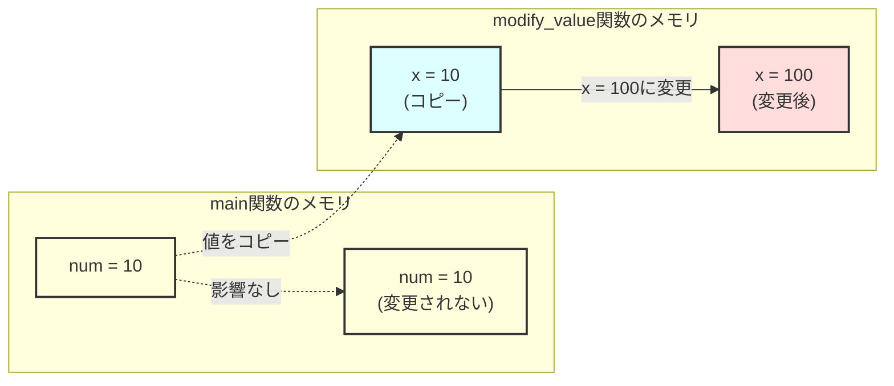
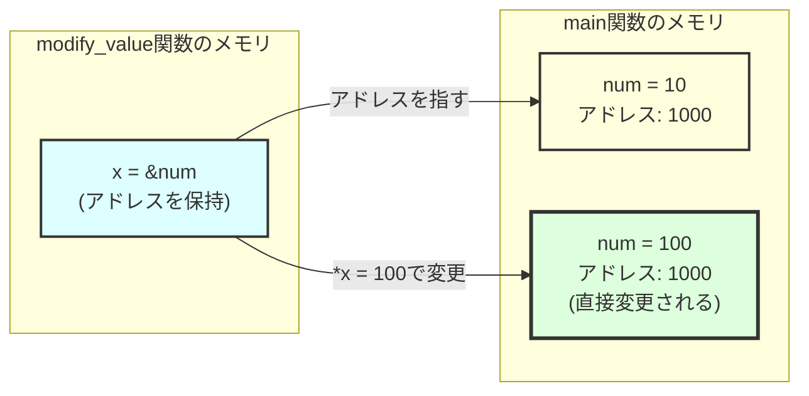
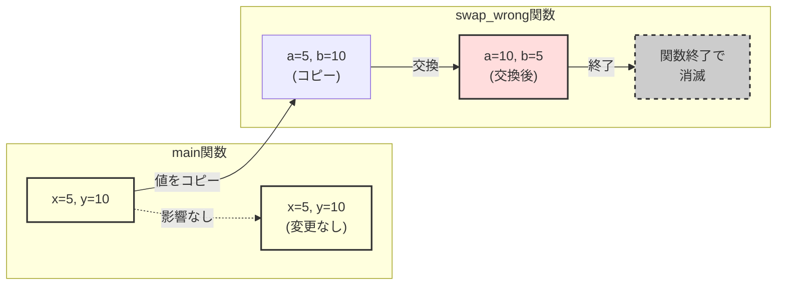
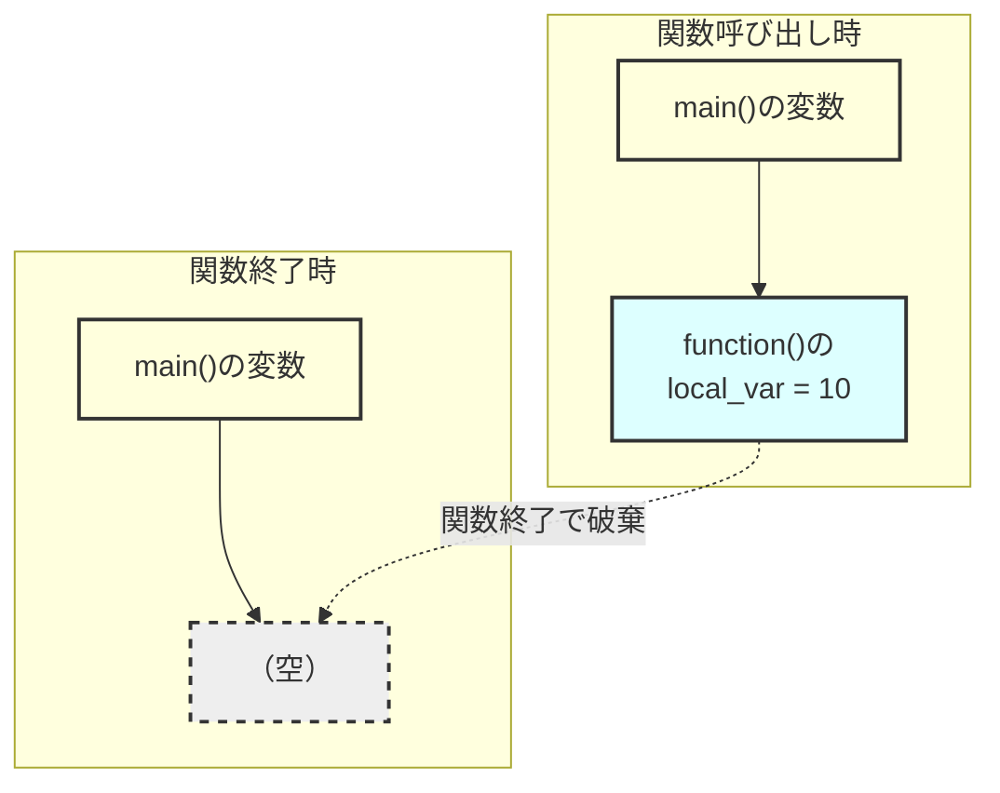

# 関数

## 対応C規格

- **主要対象：** C90
- **学習内容：** 関数の基本、引数と戻り値、関数のスコープ、再帰関数、関数プロトタイプ

## 学習目標

この章を完了すると、以下のことができるようになります。

- 関数の定義と呼び出しができる
- 引数と戻り値を適切に使える
- 関数のスコープを理解する
- 再帰関数を作成できる
- 関数プロトタイプの重要性を理解する

## 概要と詳細

### 関数とは

関数は、プログラムを「部品」に分けるための仕組みです。
大きな問題を小さな部分に分割して解決する「分割統治」の考え方を実現します。

### 関数の基本概念

関数は、名前を付けた処理の単位です。
入力を仮引数で受け取り、必要に応じて戻り値を返します。
処理を関数へ分けると、同じ処理を再利用でき、修正やテストの範囲も限定できます。

#### 関数を使う理由

1. **再利用**：同じ処理を複数の場所から呼び出せます
2. **分割**：大きな処理を、入力と出力が明確な単位へ分けられます
3. **保守**：修正やテストの対象を関数単位で絞れます
4. **可読性**：関数名によって処理の目的を示せます

#### 関数の構成要素

```c
戻り値の型 関数名(引数リスト)
{
    /* 関数本体 */
    return 戻り値;  /* 戻り値がある場合 */
}
```

### 関数の定義と宣言

関数を使うには、「宣言」と「定義」を理解する必要があります。

#### 関数プロトタイプが必要な理由

関数プロトタイプは、関数の戻り値の型と仮引数の型を呼び出しより前にコンパイラへ知らせます。
コンパイラはこの情報を使って、引数の個数や型を検査します。

#### 関数プロトタイプ（前方宣言）

```c
/* 関数プロトタイプ */
int add(int a, int b);
void print_message(void);
```

#### 関数の定義

```c
/* 関数の実装 */
int add(int a, int b)
{
    return a + b;
}

void print_message(void)
{
    printf("Hello, World!\n");
}
```

### 引数は常に値渡し

Cの関数呼び出しでは、すべての実引数が値渡しされます。
ポインターを実引数にした場合も、関数が受け取るのはポインター値のコピーです。
コピーしたポインターを間接参照すると、呼び出し側のオブジェクトを変更できます。

#### 値渡し（Call by Value）

整数などの値を渡すと、仮引数はその値で初期化されます。
仮引数を変更しても、呼び出し側のオブジェクトには影響しません。

##### 値渡しのメカニズム



##### 値渡しの実例

```c
void modify_value(int x)
{
    printf("Inside before: x = %d\n", x);
    x = 100;  /* 元の変数には影響しない */
    printf("Inside after: x = %d\n", x);
}

int main(void)
{
    int num = 10;
    printf("Before call: num = %d\n", num);

    modify_value(num);

    printf("After call: num = %d\n", num);  /* 10のまま */
    return 0;
}
```

##### 値渡しの性質

値渡しでは、仮引数への代入が呼び出し側のオブジェクトを直接変更しません。
構造体も値渡しできますが、値が大きい場合はコピーのコストが判断材料になります。
複数の結果は、構造体を戻り値にするか、出力先を指すポインターを渡して返せます。

#### ポインター値を渡す場合

オブジェクトのアドレスを表すポインター値を渡すと、関数は間接参照によってそのオブジェクトを読み書きできます。
これは参照渡しという別の呼び出し方式ではなく、ポインター値の値渡しです。

##### ポインター値がコピーされる仕組み



##### ポインターを使った変更例

```c
void modify_value(int *x)
{
    printf("Inside before: *x = %d\n", *x);
    *x = 100;  /* 元の変数を変更 */
    printf("Inside after: *x = %d\n", *x);
}

int main(void)
{
    int num = 10;
    printf("Before call: num = %d\n", num);

    modify_value(&num);  /* &でアドレスを渡す */

    printf("After call: num = %d\n", num);  /* 100に変更されている */
    return 0;
}
```

##### ポインターを渡す場合の性質

ポインターを介すと、呼び出し側のオブジェクトを変更したり、複数の出力先へ結果を書き込んだりできます。
一方、関数はポインターが指す範囲や有効期間を型だけでは判定できません。
呼び出し側と関数側で、NULLを許すか、何要素を参照できるか、書き込み可能かという契約をそろえる必要があります。

#### 配列の引数渡し

配列を表す式は、関数呼び出しでは通常、先頭要素へのポインターに変換されます。

##### 配列式と仮引数の型調整

```c
void modify_array(int arr[], int size)
{
    int i;
    for (i = 0; i < size; i++) {
        arr[i] *= 2;  /* 元の配列を変更 */
    }
}

int main(void)
{
    int numbers[5] = {1, 2, 3, 4, 5};
    int i;

    printf("Before: ");
    for (i = 0; i < 5; i++) {
        printf("%d ", numbers[i]);
    }
    printf("\n");

    modify_array(numbers, 5);

    printf("After: ");
    for (i = 0; i < 5; i++) {
        printf("%d ", numbers[i]);  /* 値が2倍になっている */
    }
    printf("\n");

    return 0;
}
```

##### 関数が受け取る値

```text
配列式は先頭要素へのポインターに変換される：

numbers[5] = {1, 2, 3, 4, 5}

numbers → [1][2][3][4][5]
          ↑
     先頭要素のアドレス

関数には、このポインター値のコピーが渡される
```

関数仮引数に書いた`int arr[]`は`int *arr`に調整されます。
配列全体や要素数は渡されないため、要素数は別の引数で指定します。

#### 構造体の引数渡し

構造体そのものを渡すと、構造体の値がコピーされます。
構造体へのポインターを渡すと、ポインター値がコピーされ、間接参照によって呼び出し側の構造体を操作できます。

##### 構造体の値渡し

```c
struct Point {
    int x;
    int y;
};

void move_point(struct Point p)
{
    p.x += 10;  /* コピーを変更（元の構造体は変わらない） */
    p.y += 10;
}
```

##### 構造体へのポインターを渡す場合

```c
void move_point_ref(struct Point *p)
{
    p->x += 10;  /* 元の構造体を変更 */
    p->y += 10;
}
```

#### ポインターを引数にする例

呼び出し側のオブジェクトを変更する関数や、複数の結果を書き込む関数は、出力先へのポインターを引数にします。

##### 1. swap関数（値の交換）

2つの変数を交換するには、それぞれの変数へのポインターを関数へ渡します。

```c
/* 値渡しでは交換できない（間違い例） */
void swap_wrong(int a, int b)
{
    int temp = a;
    a = b;
    b = temp;
    /* 関数内でコピーを交換しただけ */
}

/* 変数へのポインターを渡して交換 */
void swap_correct(int *a, int *b)
{
    int temp = *a;
    *a = *b;
    *b = temp;
}

int main(void)
{
    int x = 5, y = 10;

    printf("Before: x=%d, y=%d\n", x, y);

    swap_wrong(x, y);
    printf("After swap_wrong: x=%d, y=%d\n", x, y);  /* 5, 10のまま */

    swap_correct(&x, &y);
    printf("After swap_correct: x=%d, y=%d\n", x, y);  /* 10, 5に交換 */

    return 0;
}
```

**`swap_wrong`が呼び出し側を変更できない理由**



##### 2. 複数の値を返す関数

Cの関数が直接返す戻り値は一つです。
複数の出力先へのポインターを渡すと、それぞれのオブジェクトへ結果を書き込めます。

```c
#include <limits.h>
#include <stddef.h>
#include <stdio.h>

/* 商と余りを出力引数へ書き込む */
int divide_with_remainder(int dividend, int divisor,
                          int *quotient, int *remainder)
{
    if (quotient == NULL || remainder == NULL) {
        return -1;
    }
    if (divisor == 0 || (dividend == INT_MIN && divisor == -1)) {
        return -2;
    }

    *quotient = dividend / divisor;
    *remainder = dividend % divisor;
    return 0;
}

/* 統計情報を一度に計算する */
int calculate_stats(const int arr[], int size,
                    int *min, int *max, double *average)
{
    int i;
    double sum = 0.0;

    if (size <= 0 || arr == NULL || min == NULL ||
        max == NULL || average == NULL) {
        return -1;
    }

    *min = *max = arr[0];

    for (i = 0; i < size; i++) {
        if (arr[i] < *min) *min = arr[i];
        if (arr[i] > *max) *max = arr[i];
        sum += arr[i];
    }

    *average = (double)sum / size;
    return 0;
}

int main(void)
{
    int q, r;
    int numbers[] = {23, 67, 12, 89, 45};
    int minimum, maximum;
    double avg;

    /* 除算の例 */
    if (divide_with_remainder(17, 5, &q, &r) == 0) {
        printf("17 / 5 = %d, remainder %d\n", q, r);  /* 3 余り 2 */
    }

    /* 統計計算の例 */
    if (calculate_stats(numbers, 5, &minimum, &maximum, &avg) == 0) {
        printf("Minimum: %d, maximum: %d, average: %.1f\n",
               minimum, maximum, avg);
    }

    return 0;
}
```

##### 3. ポインター引数の検証とエラー処理

NULLを受け取る可能性がある関数は、間接参照の前にNULLかどうかを検査します。
NULLを許可しない契約にする場合は、その事前条件をAPIの利用者へ明示します。

```c
#include <limits.h>

/* 基本的なNULLチェック */
void safe_increment(int *ptr)
{
    if (ptr != NULL) {  /* NULLポインターチェック */
        (*ptr)++;
    }
}

/* より実践的な例：文字列の安全なコピー */
int safe_string_copy(char *dest, const char *src, int dest_size)
{
    int i;

    /* 引数の検証 */
    if (dest == NULL || src == NULL || dest_size <= 0) {
        return -1;  /* エラー */
    }

    /* 安全にコピー */
    for (i = 0; i < dest_size - 1 && src[i] != '\0'; i++) {
        dest[i] = src[i];
    }
    dest[i] = '\0';  /* null終端を保証 */

    return i;  /* コピーした文字数を返す */
}

/* エラーコードを返す関数の例 */
int safe_divide(int a, int b, int *result)
{
    if (result == NULL) {
        return -1;  /* 引数エラー */
    }

    if (b == 0 || (a == INT_MIN && b == -1)) {
        return -2;  /* ゼロ除算エラー */
    }

    *result = a / b;
    return 0;  /* 成功 */
}
```

##### 4. 大きなデータ構造の効率的な処理

構造体が大きくなると、値渡しのコピーコストが無視できなくなります。

```c
/* 大きな構造体の例 */
struct StudentRecord {
    char name[50];
    char id[20];
    int scores[10];
    double gpa;
    char address[100];
};

/* 構造体の値を渡す */
void print_student_by_value(struct StudentRecord student)
{
    printf("Name: %s\n", student.name);
    printf("GPA: %.2f\n", student.gpa);
}

/* const修飾した構造体へのポインター値を渡す */
void print_student_by_reference(const struct StudentRecord *student)
{
    if (student == NULL) return;

    printf("Name: %s\n", student->name);
    printf("GPA: %.2f\n", student->gpa);
}

/* 構造体を変更する関数 */
void update_gpa(struct StudentRecord *student, double new_gpa)
{
    if (student == NULL) return;

    student->gpa = new_gpa;
    printf("Updated %s GPA to %.2f\n",
           student->name, new_gpa);
}
```

##### 5. 配列操作の実践例

配列式から変換されたポインターだけでは、参照できる要素数が分かりません。
配列を処理する関数には、要素数や処理範囲も渡します。

```c
/* 配列の要素をすべて特定の値に設定 */
void fill_array(int arr[], int size, int value)
{
    int i;

    if (arr == NULL || size <= 0) return;

    for (i = 0; i < size; i++) {
        arr[i] = value;
    }
}

/* 2つの配列を比較 */
int compare_arrays(const int arr1[], const int arr2[], int size)
{
    int i;

    if (arr1 == NULL || arr2 == NULL || size <= 0) {
        return -1;  /* エラー */
    }

    for (i = 0; i < size; i++) {
        if (arr1[i] != arr2[i]) {
            return 0;  /* 異なる */
        }
    }

    return 1;  /* 同じ */
}

/* 配列の一部を別の配列にコピー */
int copy_array_range(int dest[], int dest_size,
                     const int src[], int src_size,
                     int start, int count)
{
    int i;

    if (dest == NULL || src == NULL || start < 0 || count < 0) return -1;
    if (start > src_size || count > src_size - start) return -1;
    if (count > dest_size) return -1;

    for (i = 0; i < count; i++) {
        dest[i] = src[start + i];
    }
    return 0;
}
```

このコピー関数は、コピー元とコピー先の範囲が重ならないことを前提とします。

##### 6. 戻り値と出力引数の組み合わせ

戻り値で処理結果の状態を返し、ポインターで指定された出力先へ値を書き込む設計があります。

```c
#include <errno.h>
#include <limits.h>
#include <stdlib.h>

/* 文字列を整数に変換（エラーチェック付き） */
int string_to_int(const char *str, int *result)
{
    char *end;
    long value;

    if (str == NULL || result == NULL) {
        return -1;  /* 引数エラー */
    }

    errno = 0;
    value = strtol(str, &end, 10);
    if (end == str || *end != '\0' || errno == ERANGE ||
        value < INT_MIN || value > INT_MAX) {
        return -2;
    }

    *result = (int)value;
    return 0;  /* 成功 */
}

/* 使用例 */
int main(void)
{
    int num;
    int status;

    status = string_to_int("123", &num);
    if (status == 0) {
        printf("Converted: %d\n", num);
    } else {
        printf("Conversion failed: %d\n", status);
    }

    return 0;
}
```

##### 7. 引数の型を選ぶ基準

**オブジェクトの値を直接渡す例：**

- 基本データ型（int, char, float, double）
- コピーのコストを許容できる構造体
- 関数から呼び出し側のオブジェクトを変更する必要がない場合

**オブジェクトへのポインターを渡す例：**

- 大きな構造体や配列
- 複数の値を返したい場合
- 元の値を変更する必要がある場合
- 構造体のコピーを避けたい場合

**`const`修飾した型へのポインターを渡す例：**

- 大きなデータを読むだけの場合
- 誤った変更を防ぎたい場合
- APIの意図を明確にしたい場合

#### const修飾子による保護

ポインターを介してオブジェクトを変更させない場合は、ポインターが指す型を`const`で修飾します。

```c
/* 配列の内容を変更しない関数 */
int array_sum(const int arr[], int size)
{
    int i, sum = 0;

    /* arr[i] = 0;  コンパイルエラー（constで保護） */

    for (i = 0; i < size; i++) {
        sum += arr[i];  /* 読み取りはOK */
    }

    return sum;
}
```

#### 引数渡しのベストプラクティス

1. **基本データ型（int, char, floatなど）**

    - 通常は値渡しを使用
    - 呼び出し側の値を変更する場合は、そのオブジェクトへのポインターを渡す

2. **配列**

    - 配列式は先頭要素へのポインターに変換される
    - 変更しない場合はconstを付ける

3. **構造体**

    - コピーのコストを許容できる構造体：構造体の値を直接渡す
    - コピーを避ける構造体：構造体へのポインターを渡す
    - 変更しない場合：`const`修飾した型へのポインターを渡す

4. **文字列**

    - char配列またはchar*で渡す
    - 変更しない場合はconstを付ける

### 様々な関数の種類

関数は、戻り値や仮引数の有無によって宣言が変わります。
用途に応じて関数型を選びます。

#### 戻り値のない関数（void関数）

処理だけ行って、結果を返さない関数です。

```c
void print_header(void)
{
    printf("====================\n");
    printf(" Program start\n");
    printf("====================\n");
}

void greet_user(char *name)
{
    printf("Hello, %s\n", name);
}
```

#### 配列を扱う関数

```c
/* 配列の要素数を計算できないため、サイズを別途渡す必要がある */
int array_sum(int arr[], int size)
{
    int i, sum = 0;

    for (i = 0; i < size; i++)
    {
        sum += arr[i];
    }

    return sum;
}

/* 配列を初期化する関数 */
void initialize_array(int arr[], int size, int value)
{
    int i;

    for (i = 0; i < size; i++)
    {
        arr[i] = value;
    }
}
```

### 再帰関数

再帰関数は自分自身を呼び出す関数です。

#### 再帰関数の例

再帰関数には、再帰を終了する基底条件と、問題を小さくする再帰呼び出しが必要です。
次の`factorial`は`n - 1`を渡して問題を縮小し、`n <= 1`で呼び出しを止めます。

```c
/* 階乗を計算する再帰関数 */
int factorial(int n)
{
    if (n <= 1) {
        return 1;  /* 基底条件 */
    }
    return n * factorial(n - 1);  /* 再帰呼び出し */
}

/* フィボナッチ数列を計算する再帰関数 */
int fibonacci(int n)
{
    if (n <= 0) {
        return 0;
    }
    if (n == 1) {
        return 1;
    }
    return fibonacci(n - 1) + fibonacci(n - 2);
}
```

#### 再帰関数の構成要素

1. **基底条件** - 再帰を終了する条件
2. **再帰呼び出し** - 自分自身を呼び出す部分
3. **問題の分割** - 元の問題をより小さな問題に分割

### 関数のスコープと生存期間

変数を利用できるソースコード上の範囲を**スコープ**、オブジェクトが保持される期間を**記憶域期間**と呼びます。
両者は別の概念です。

#### ローカル変数とグローバル変数

関数内やブロック内で宣言した識別子の多くはブロックスコープを持ちます。
関数の外で宣言した識別子はファイルスコープを持ちます。

#### ローカル変数の詳細

関数内で宣言したローカル変数は、宣言位置を含むブロック内で参照できます。
通常のローカル変数は自動記憶域期間を持ち、ブロックへ入るたびにオブジェクトの生存期間が始まります。

##### ローカル変数の特徴

```c
void function_example(void)
{
    int local_var = 10;  /* この関数内でのみ有効 */

    {  /* ブロックスコープ */
        int block_var = 20;  /* このブロック内でのみ有効 */
        printf("block_var = %d\n", block_var);
    }  /* block_varはここで破棄される */

    /* printf("%d\n", block_var); エラー：block_varは見えない */

}  /* local_varはここで破棄される */
```

##### ローカル変数のメモリ配置



##### 同名のローカル変数

```c
void func1(void)
{
    int count = 0;  /* func1のcount */
    count++;
    printf("func1: count = %d\n", count);  /* 1 */
}

void func2(void)
{
    int count = 100;  /* func2のcount（func1とは別物） */
    count++;
    printf("func2: count = %d\n", count);  /* 101 */
}

int main(void)
{
    int count = 50;  /* mainのcount */

    func1();  /* func1のcountを使用 */
    func2();  /* func2のcountを使用 */

    printf("main: count = %d\n", count);  /* 50（変更されない） */
    return 0;
}
```

#### グローバル変数の詳細

関数の外で宣言した変数はファイルスコープを持ちます。
外部リンケージを持つ変数は、別の翻訳単位から`extern`宣言を介して参照できます。
`static`を付けた変数は内部リンケージを持ち、その翻訳単位だけで名前を参照できます。

##### グローバル変数の宣言と使用

```c
/* グローバル変数の宣言 */
int global_count = 0;      /* 初期化あり */
double global_rate;        /* 初期化なし（0.0になる） */
char global_message[100];  /* 初期化なし（全て0になる） */

void increment_counter(void)
{
    global_count++;  /* どの関数からでもアクセス可能 */
}

void print_counter(void)
{
    printf("Counter: %d\n", global_count);
}

int main(void)
{
    print_counter();     /* カウンター: 0 */
    increment_counter();
    increment_counter();
    print_counter();     /* カウンター: 2 */

    global_count = 10;   /* main関数からも変更可能 */
    print_counter();     /* カウンター: 10 */

    return 0;
}
```

##### グローバル変数の初期化

```c
/* グローバル変数は自動的に0で初期化される */
int g_int;          /* 0 */
double g_double;    /* 0.0 */
char g_char;        /* '\0' */
int g_array[10];    /* すべて0 */

/* 明示的な初期化も可能 */
int g_initialized = 100;
char g_string[] = "Hello, Global!";

/* 関数呼び出しによる初期化はできない */
/* int g_value = get_value(); 定数式ではないため初期化できない */
```

#### 変数の可視性（スコープ）と名前の隠蔽

同じ名前の変数が複数ある場合、最も内側のスコープの変数が優先されます。

```c
int value = 100;  /* グローバル変数 */

void test_scope(void)
{
    printf("1: value = %d\n", value);  /* 100（グローバル） */

    {
        int value = 200;  /* グローバル変数を隠蔽 */
        printf("2: value = %d\n", value);  /* 200 */

        {
            int value = 300;  /* 外側のブロックの変数を隠蔽 */
            printf("3: value = %d\n", value);  /* 300 */
        }

        printf("4: value = %d\n", value);  /* 200 */
    }
}

int main(void)
{
    test_scope();
    printf("5: value = %d\n", value);  /* 100（グローバル） */
    return 0;
}
```

#### グローバル変数の問題点と対策

##### 1. 予期しない変更

```c
int total_score = 0;  /* グローバル変数 */

void add_score(int points)
{
    total_score += points;
}

void reset_score(void)
{
    total_score = 0;  /* 他の処理が共有している状態も変更する */
}

/* より良い設計：引数と戻り値を使用 */
int add_score_safe(int current_score, int points)
{
    return current_score + points;
}
```

##### 2. デバッグの困難さ

```c
/* 悪い例：グローバル変数を多用 */
int g_width, g_height, g_area;

void calculate_area(void)
{
    g_area = g_width * g_height;
}

/* 良い例：引数と戻り値を使用 */
int calculate_area_safe(int width, int height)
{
    return width * height;
}
```

##### 3. 名前の衝突

```c
/* file1.c */
int counter = 0;  /* グローバル変数 */

/* file2.c */
int counter = 0;  /* 同じ外部名の定義が重複し、リンクに失敗する */

/* 対策：staticを使用してファイルスコープに限定 */
static int counter = 0;  /* このファイル内でのみ有効 */
```

#### ローカル変数とグローバル変数の使い分け

##### ローカル変数を使うべき場合（推奨）

```c
/* 関数内で完結する処理 */
double calculate_average(int arr[], int size)
{
    int i;
    int sum = 0;  /* ローカル変数 */

    for (i = 0; i < size; i++) {
        sum += arr[i];
    }

    return (double)sum / size;
}

/* 一時的な計算 */
void print_multiplication_table(int n)
{
    int i, j;  /* ループカウンタはローカル変数 */

    for (i = 1; i <= n; i++) {
        for (j = 1; j <= n; j++) {
            printf("%4d", i * j);
        }
        printf("\n");
    }
}
```

##### グローバル変数が適切な場合（限定的）

```c
/* 設定値やフラグ */
int debug_mode = 0;  /* デバッグモードのフラグ */
const double PI = 3.14159265359;  /* 定数 */

/* プログラム全体の状態 */
char program_name[256] = "MyApplication";
int error_count = 0;

void enable_debug(void)
{
    debug_mode = 1;
}

void log_message(const char *msg)
{
    if (debug_mode) {
        printf("[DEBUG] %s\n", msg);
    }
}
```

#### グローバル変数の安全な使用方法

##### 1. constを使用して読み取り専用にする

```c
const int MAX_USERS = 100;
const double TAX_RATE = 0.08;
const char VERSION[] = "1.0.0";
```

##### 2. staticでファイルスコープに限定

```c
/* このファイル内でのみ使用可能 */
static int file_local_counter = 0;

static void increment_counter(void)
{
    file_local_counter++;
}
```

##### 3. アクセス関数を提供する

```c
/* グローバル変数を直接公開しない */
static int score = 0;  /* ファイルスコープ */

/* アクセス関数を通じて操作 */
int get_score(void)
{
    return score;
}

void set_score(int new_score)
{
    if (new_score >= 0) {  /* 検証も可能 */
        score = new_score;
    }
}

void add_score(int points)
{
    if (points > 0) {
        score += points;
    }
}
```

#### 変数のスコープを限定する指針

1. **可能な限りローカル変数を使用する**

    - バグが少なく、理解しやすいコードになる

2. **グローバル変数は最小限に**

    - 本当に必要な場合のみ使用
    - constやstaticで保護する

3. **明確な命名規則**

    - グローバル変数にはプレフィックスを付ける（例：g_count）
    - 意味のある名前を使用する

4. **初期化を忘れない**

    - ローカル変数は必ず初期化する
    - グローバル変数の初期値も明示する

#### static変数

```c
void counter_function(void)
{
    static int count = 0;  /* 初回のみ初期化 */
    count++;
    printf("Call count: %d\n", count);
}
```

### 関数ポインターの基礎

関数ポインターは、指定した戻り値の型と仮引数の型を持つ関数を指します。
同じ関数ポインター変数へ互換性のある別の関数を代入すると、呼び出す処理を実行時に選べます。

#### 基本的な関数ポインター

```c
/* 関数の定義 */
int add(int a, int b)
{
    return a + b;
}

int multiply(int a, int b)
{
    return a * b;
}

int main(void)
{
    /* 関数ポインターの宣言 */
    int (*operation)(int, int);

    /* 関数ポインターに関数を代入 */
    operation = add;
    printf("Add: %d\n", operation(5, 3));

    operation = multiply;
    printf("Multiply: %d\n", operation(5, 3));

    return 0;
}
```

## 実例コード

完全な実装例は以下のファイルを参照してください。

### 基本的な関数の使い方

- [function_basics.c](examples/function_basics.c) - C90準拠版
- [function_basics_c99.c](examples/function_basics_c99.c) - C99準拠版

### 高度な関数の使い方

- [advanced_functions.c](examples/advanced_functions.c) - C90準拠版
- [advanced_functions_c99.c](examples/advanced_functions_c99.c) - C99準拠版

## コンパイルと実行

```bash

# 基本的な関数の例をコンパイル

gcc -Wall -Wextra -pedantic -std=c90 examples/function_basics.c -o function_basics

# 実行

./function_basics

# C99版をコンパイル

gcc -Wall -Wextra -pedantic -std=c99 examples/function_basics_c99.c -o function_basics_c99

# 数学関数を使う場合は-lmを追加

gcc -Wall -Wextra -pedantic examples/advanced_functions.c -lm -o advanced_functions
```

## 注意事項

関数を定義し、呼び出すときは次の点を確認します。

1. **関数プロトタイプ**：呼び出しより後で関数を定義する場合は、先にプロトタイプを宣言する

   ```c
   /* 不適切: 呼び出しより前に宣言がない */
   int main(void) {
       add(1, 2);
       return 0;
   }
   int add(int a, int b) { return a + b; }
   ```

2. **配列の扱い**：配列式から変換されたポインターと、処理する要素数を一緒に渡す

   ```c
   /* NG: サイズが分からない */
   void print_array(int arr[]) { /* 要素数不明 */ }

   /* OK: サイズも渡す */
   void print_array(int arr[], int size) { /* OK */ }
   ```

3. **再帰の深さ**：再帰が深くなると、処理系が利用できる呼び出し用の記憶領域を使い切る可能性がある

4. **ファイルスコープ変数**：共有する範囲を限定し、必要なら`static`で内部リンケージにする

5. **`static`変数**：ブロックを抜けても値が保持されるため、呼び出し間で状態を共有する意図を明確にする

## 次のステップ

関数の基本を理解したら、以下のトピックに進みましょう。

1. より複雑な関数の設計パターン
2. 関数ポインターと高階関数
3. 可変長引数関数（stdarg.h）
4. インライン関数（C99以降）
5. ライブラリ関数の作成

## 学習フローとコンパイル方法

### 推奨学習順序

1. **理論学習**: README.mdで基本概念を理解
2. **サンプルコード**: examples/の基本例を確認
3. **演習課題**: exercises/README.mdで課題を確認
4. **実装練習**: solutions/の解答例を参考に自分で実装

### Makefileを使用したコンパイル

```bash

# 全てのプログラムをコンパイル

make all

# 特定のプログラムをコンパイル

make function_basics

# C99版をコンパイル

make function_basics_c99

# プログラムを実行

make run-all

# クリーンアップ

make clean
```

## 次の章へ

[構造体とポインター](../structures/README.md)

## 参考資料

- [C90規格書](https://www.iso.org/standard/17782.html)
- [C99規格書](https://www.iso.org/standard/29237.html)

## 演習問題

[演習問題](exercises/)では、プロトタイプ、値渡し、ポインター引数、再帰、スコープを確認できます。

- 基礎問題：基本的な文法や概念の確認
- 応用問題：より実践的なプログラムの作成
- チャレンジ問題：高度な理解と実装力が必要な問題
